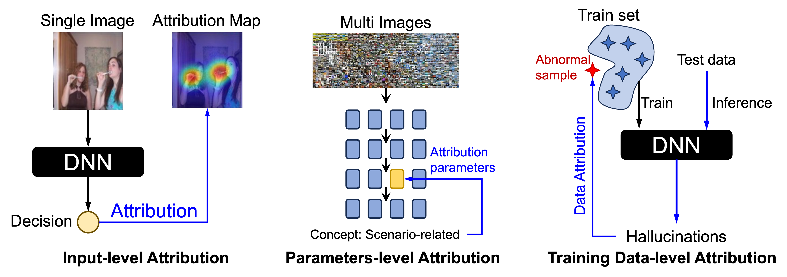

# 🌟 Awesome Interpretable Attribution Mechanistic

  
  <h2 align="center">Peering into the Black Box of DNNs.</h2>

  

  
<em>A curated collection of resources focused on the Interpretable Attribution Mechanistic from small models to large models.</em>

## 🔔 News

- **[July 25, 2025]** I created this repository to maintain a paper list on **Interpretable Attribution Mechanistic**. Contributions are welcome!!!
